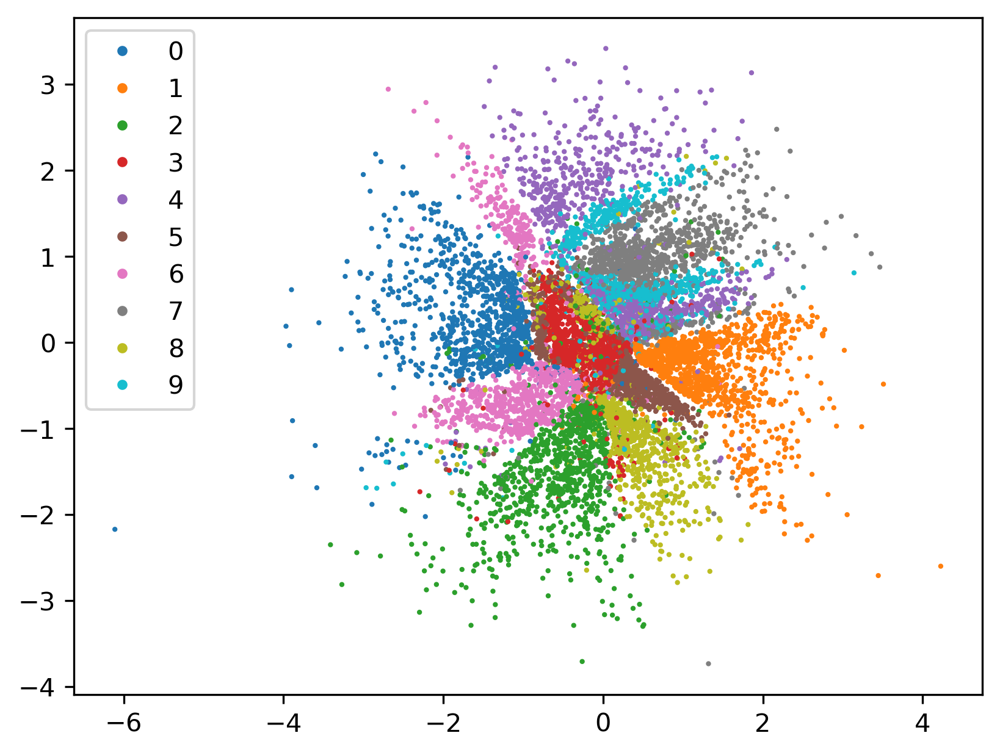
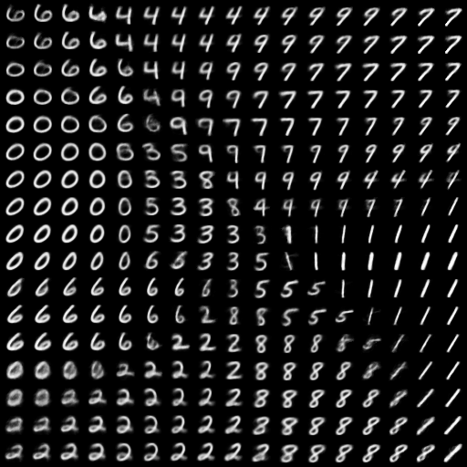

# AAE

This repository contains my attempt at reproducing some results from the paper [Adversarial Autoencoders](https://arxiv.org/abs/1511.05644).

## Experiments

### 2D Gaussian prior

Hidden code | Manifold
:---: | :---:
 | 


## Reference

```bibtex
@misc{makhzani2016adversarialautoencoders,
      title={Adversarial Autoencoders}, 
      author={Alireza Makhzani and Jonathon Shlens and Navdeep Jaitly and Ian Goodfellow and Brendan Frey},
      year={2016},
      eprint={1511.05644},
      archivePrefix={arXiv},
      primaryClass={cs.LG},
      url={https://arxiv.org/abs/1511.05644}, 
}
```